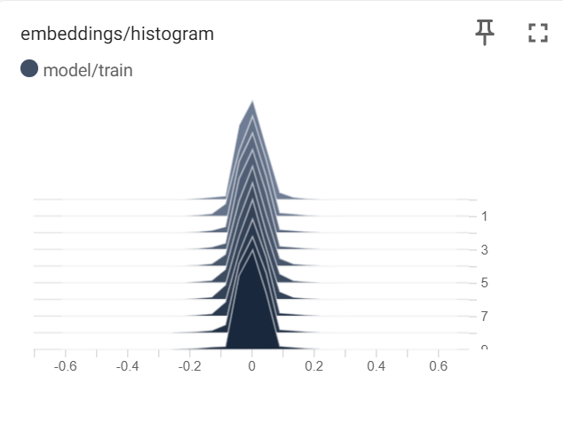

# Implementa-o-de-NLU-com-Rede-Neural---Pedro-Silva

1. Introdução

Objetivo: O objetivo do código desenvolvido é comparar o desempenho do Embedding Layer do Tensorflow no modelo de rede neural para classificação de intenções em relação a uma implementação alternativa utilizando vetorização Word2vec. As métricas utilizadas para fazer a comparação são a de acurácia, recall e f1-score.

Ferramentas e Bibliotecas Utilizadas: Para ajudar na comparação foram utilizadas bibliotecas como TensorBoard, tensorflow, numpy e scikit-learn.

2. Carregamento e Pré-processamento dos Dados

Fonte dos Dados: Os dados utilizados são os da base de dados do projeto, fornecidos pela empresa Brastel, os mesmos foram carregados do Google Drive.

Métodos de Pré-processamento: Foram realizados métodos de pré-processamento aplicados aos dados textuais antes de inseri-los à rede neural, como tokenização e pad sequences.

3. Modelagem e Análise

Algoritmos Utilizados: No primeiro modelo foi utilizado o Embedding Layer do Tensorflow, além de algumas camadas contendo o otimizador Adam e a função de perda 'sparse_categorical_crossentropy'. Já no segundo modelo, foi utilizado a vetorização Word2vec e algumas camadas contendo o otimizador Adam e a função de perda 'sparse_categorical_crossentropy' novamente.

Métricas de Avaliação: As métricas de avaliação levadas em consideração foram: acurácia recall e f1-score.

4. Resultados

Principais Resultados: No primeiro modelo contendo o Embedding Layer do Tensorflow, os resultados de acurácia, recall e f1-score foram 0.3762376308441162, 0.37750463441349297 e 0.37623762376237624, respectivamente. Já no segundo modelo que utilizou a vetorização Word2vec, os resultados de acurácia, recall e f1-score foram 0.20792078971862793, 0.2079207920792079 e 0.07157928907644863, respectivamente.

Outros resultados obtidos:

